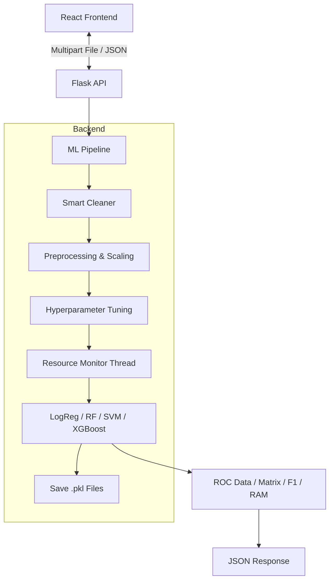

# 🤖 AutoML Model Comparator & Resource Monitor

> **A Full-Stack Application for Automated Machine Learning, Hyperparameter Tuning, and Computational Resource Profiling.**

This application allows users to upload a dataset, automatically preprocesses the data (handling dirty inputs), and trains multiple state-of-the-art Machine Learning models in parallel. 

Uniquely, it creates a **"Resource-Aware Leaderboard"**, ranking models not just by accuracy, but by their computational cost (CPU, RAM, and Training Time). Users can dynamically sort the leaderboard, **visualize performance metrics** (ROC Curves, Confusion Matrices), and **download the specific model** that best fits their needs.

---

## 🌟 Key Features

* **⚡ Multi-Model Pipeline:** Trains Logistic Regression, Random Forest, SVM, KNN, and XGBoost with automated Hyperparameter Tuning (`RandomizedSearchCV`).
* **📈 Dynamic Visualizations:** Interactive **ROC Curves** and **Confusion Matrices** that update instantly based on the currently selected "Best Model".
* **🔍 Column Auto-Detection:** Frontend uses `PapaParse` to scan CSV headers immediately, providing a **dropdown list** of columns for the target variable.
* **☑️ Selective Training:** Users can toggle specific models on/off to skip computationally expensive algorithms (like SVM) on large datasets.
* **🧹 Smart Data Cleaning:** Automatically detects and drops irrelevant columns (e.g., `id`, `ID`) and cleans "dirty" CSVs with trailing commas or empty columns.
* **🌗 Dark/Light Mode:** Fully responsive UI with a persistent Dark Mode toggle for comfortable viewing.
* **🖥 Hardware Profiling:** A custom-built `ResourceMonitor` tracks **Peak RAM (MB)** and **CPU Usage (%)** in real-time during training.
* **💾 Dynamic Model Download:** Save and download the specific model that currently tops the leaderboard (e.g., if you sort by "Lowest CPU", the download button provides the most efficient model).

---

## 🏗 Architecture

The application follows a decoupled Client-Server architecture:



---

## 🛠 Tech Stack

### **Backend (Python)**
* **Flask:** API Server.
* **Scikit-Learn:** Model training and preprocessing pipelines.
* **XGBoost:** Gradient boosting implementation.
* **Pandas & NumPy:** Data manipulation.
* **Psutil:** System resource monitoring (RAM/CPU).
* **Joblib:** Parallel processing.

### **Frontend (React)**
* **React.js:** Component-based UI.
* **Recharts:** Responsive, dynamic charting for ROC curves.
* **PapaParse:** Client-side CSV header parsing.
* **Axios:** HTTP Client.
* **Bootstrap 5:** Responsive styling and layout.

---

## 🚀 Installation & Setup

### 1. Prerequisites
* Python 3.8+
* Node.js & npm
* *(macOS Users only)*: `brew install libomp` (Required for XGBoost)

### 2. Backend Setup
Navigate to the backend folder and set up the Python environment.

```bash
cd backend

# Create Virtual Environment
python3 -m venv .venv

# Activate Environment
# On macOS/Linux:
source .venv/bin/activate
# On Windows:
# .venv\Scripts\activate

# Install Dependencies
pip install -r requirements.txt
```

### 3. Frontend Setup
Open a new terminal, navigate to the frontend folder, and install Node modules.

```bash
cd frontend

# Install dependencies
npm install
```

---

## ▶️ Usage Guide

### 1. Start the Server
In your **Backend** terminal:
```bash
python app.py
```
*Server will start on `http://127.0.0.1:5000`*

### 2. Launch the UI
In your **Frontend** terminal:
```bash
npm start
```
*App will open at `http://localhost:3000`*

### 3. Run the Pipeline
1.  **Upload Data:** Select a clean CSV file (e.g., Iris, Titanic, Breast Cancer).
2.  **Target Column:** Select the target column from the dropdown list (auto-detected) or type it manually.
3.  **Select Models:** Use the checkboxes to choose which models to run.
4.  **Launch:** Click "Launch Pipeline".

### 4. Analyze and Download
1. **Sort:** Use the dropdown to prioritize Accuracy, F1 Score, Time, or CPU.
2. **Visual Analysis:** Scroll down to see the Confusion Matrix and ROC Curve for the winning model.
3. **Download:** Click the "⬇️ Download [Model Name]" button to get the serialized `.pkl` file for the current winner.
---

## 📂 Project Structure

```text
automl-app/
├── backend/                 # Python Flask Server
│   ├── .venv/               # Virtual Environment
│   ├── app.py               # API Entry Point & Download Routes
│   ├── pipeline.py          # ML Training, Cleaning & Saving Logic
│   ├── monitor.py           # Custom RAM/CPU Tracker
│   ├── models/              # Saved .pkl files (Generated at runtime)
│   ├── uploads/             # Temporary dataset storage
│   └── requirements.txt     # Python Dependencies
│
├── frontend/                # React Client
│   ├── src/
│   │   ├── App.js           # Main UI (Upload, Dark Mode, Checkboxes)
│   │   ├── Leaderboard.js   # Results Table & Dynamic Download
│   │   ├── ROCChart.js      # Recharts Visualization
│   │   ├── ConfusionMatrix.js # Grid Visualization
│   │   └── index.js         # Entry point
│   ├── public/
│   └── package.json         # JS Dependencies
│
└── README.md                # Documentation
```

---

## 🧠 How It Works

### The Resource Monitor
Standard ML libraries do not report hardware usage. This project uses a custom Context Manager (`backend/monitor.py`) that spawns a background thread alongside the model training to snapshot system stats.

### Dynamic Visualizations

The backend calculates the Confusion Matrix and ROC Curve points for every trained model and sends this raw data to the frontend. The React frontend renders these using `Recharts`. When a user changes the sorting criteria (e.g., prioritizes "Lowest CPU"), the charts instantly redraw to reflect the performance of the new "Best Model."

### Dynamic Model Saving

When the pipeline runs, it serializes every trained model into the `backend/models/` directory using `joblib`. This allows the frontend to request a specific model file based on the user's sorting preference.

```python
# Example logic
with ResourceMonitor() as monitor:
    model.fit(X_train, y_train)
print(monitor.max_ram) # Reports peak memory usage
```

### The Sorting Logic (Smart Sort)
The frontend implementation (`Leaderboard.js`) uses a multi-tiered sorting algorithm:
* **Accuracy Mode:** Sorts by Accuracy (Desc) -> Tie-breaker: Time (Asc).
* **Efficiency Mode:** Sorts by CPU (Asc) -> Tie-breaker: F1 Score (Desc).

---

## 🔮 Future Roadmap

* [ ] **Regression Support:** Add support for continuous target variables (currently Classification only).
* [ ] **Advanced Feature Engineering:** Automated feature selection and interaction terms.
* [ ] **Docker:** Containerize the application for easy deployment.

---
