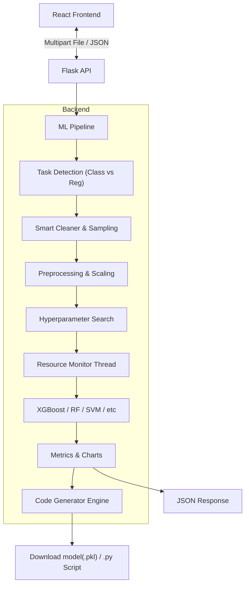

# 🤖 AutoML Model Comparator & Code Generator

> **A Modern, Full-Stack AutoML Platform for Classification & Regression.** > *Now featuring Python Code Generation, Glassmorphism UI, and Resource Profiling.*

This application allows users to upload any dataset (CSV), automatically detects the task type (**Classification** or **Regression**), and trains multiple state-of-the-art models in parallel. 

It goes beyond simple metrics by providing a **Resource-Aware Leaderboard** (CPU/RAM efficiency), **Interactive Visualizations** (ROC/Confusion Matrix/Scatter Plots), and a unique **Code Generation Engine** that writes a clean, reproduceable Python script for your winning model.

---

## 🌟 Key Features

### 🧠 Dual-Mode Machine Learning
* **🎯 Classification:** Logistic Regression, Random Forest, SVM, KNN, XGBoost.
    * *Metrics:* Accuracy, F1 Score, ROC-AUC.
    * *Visuals:* Interactive ROC Curves & Confusion Matrices.
* **📈 Regression:** Linear Regression, Ridge, Lasso, Decision Trees, Random Forest, XGBoost.
    * *Metrics:* R2 Score, RMSE, MAE.
    * *Visuals:* Actual vs. Predicted Scatter Plots with Perfect Fit lines.

### ⚡ Performance & Optimization
* **Expanded Hyperparameter Tuning:** Uses `RandomizedSearchCV` with an expanded search space (e.g., `gamma` for SVM, `subsample` for XGBoost, `min_samples_leaf` for Trees).
* **Smart Model Switching:** Automatically switches from computationally expensive models (SVM/SVR) to optimized equivalents (SGD) when dataset rows exceed 2,000.
* **Hardware Profiling:** A custom context manager tracks **Peak RAM (MB)** and **CPU Usage (%)** for every specific model training run.

### 🎨 Modern UX & "Glassmorphism" UI
* **Instant Data Stats:** Uses an intelligent "Chunk Reader" to estimate row counts for large files (1GB+) in milliseconds without freezing the browser.
* **Aesthetic Design:** Features a custom CSS **Glassmorphism** interface, animated gradients, and a polished Dark/Light mode.
* **Sortable Leaderboard:** Rank models by Accuracy/R2, but also by Training Time or RAM efficiency.

### 📜 Reproducibility
* **Download Model:** Export the serialized `.pkl` file for immediate deployment.
* **Generate Script (New):** Click one button to generate a clean, standalone `train_model.py` script pre-filled with the **exact hyperparameters** of the winning model.

---

## 🏗 Architecture



---

## 🛠 Tech Stack

### **Backend (Python)**
* **Flask:** REST API & Background Threading.
* **Scikit-Learn:** Models, Pipelines, Imputation, and Metrics.
* **XGBoost:** Optimized Gradient Boosting.
* **Joblib:** Model serialization.
* **Psutil:** Real-time hardware resource tracking.
* **Pandas & Numpy:** Data processing and vectorization.

### **Frontend (React)**
* **React 18:** Hooks-based UI architecture.
* **Custom CSS:** Glassmorphism, gradients, and animations (No standard Bootstrap theme).
* **Recharts:** Responsive visualizations (ROC & Scatter).
* **PapaParse:** Worker-based CSV parsing for large files.
* **Axios:** Async polling and file uploads.

---

## 🚀 Installation & Setup

### 1. Prerequisites
* Python 3.8+
* Node.js & npm
* *(macOS Users only)*: `brew install libomp` (Required for XGBoost)

### 2. Backend Setup
Navigate to the backend folder and set up the Python environment.

```bash
cd backend

# Create Virtual Environment
python3 -m venv .venv

# Activate Environment
# On macOS/Linux:
source .venv/bin/activate
# On Windows:
# .venv\Scripts\activate

# Install Dependencies
pip install -r requirements.txt
```

### 3. Frontend Setup
Open a new terminal, navigate to the frontend folder, and install Node modules.

```bash
cd frontend

# Install dependencies
npm install
```

---

## ▶️ Usage Guide

### 1. Start the Server
In your **Backend** terminal:
```bash
python app.py
```
*Server runs on `http://127.0.0.1:5000` with threaded task execution.*

### 2. Launch the UI
In your **Frontend** terminal:
```bash
npm start
```
*App opens at `http://localhost:3000`*

### 3. Run the Pipeline
1.  **Upload:** Drop your CSV file. The app instantly estimates rows/cols.
2.  **Select Target:** Choose your prediction target from the dropdown.
3.  **Task Detection:** The app auto-suggests Classification or Regression (you can override this).
4.  **Launch:** Watch the real-time logs as models train in parallel.

### 4. Analyze, Export, Reproduce
1.  **Sort:** Click "RAM" or "Time" headers to find efficient models, or "Accuracy/R2" for best performance.
2.  **Visualize:** See the Confusion Matrix (Classification) or Actual vs. Predicted scatter (Regression).
3.  **Get Code:** Click **"📜 Generate Python Script"** to download a `.py` file that reproduces that exact model.

---

## 🔐 API Key Authentication

The application is protected by API key authentication to prevent unauthorized access.

### Setup
1. Create a `.env` file in the `backend/` folder:
```bash
cd automl-app/backend
echo "AUTOML_API_KEY=your-secret-key-here" > .env
```

2. Replace `your-secret-key-here` with a strong, unique key.

3. Users must enter this API key in the login screen to access the application.

> **Note:** The `.env` file is excluded from git. Never commit your API key.

---

## 🐳 Docker Deployment

Deploy the application as a single Docker container where Flask serves both the API and the React frontend.

### Prerequisites
* Docker installed on your server

### Build the Image
```bash
cd automl-app
docker build -t automl .
```

### Run the Container
```bash
docker run -d \
  -p 5000:5000 \
  -e AUTOML_API_KEY=your-secret-key-here \
  --name automl \
  automl
```

The application will be available at `http://your-server-ip:5000`

### Useful Commands
```bash
docker logs automl       # View application logs
docker stop automl       # Stop the container
docker start automl      # Start the container
docker rm automl         # Remove the container
```

---

## 📂 Project Structure

```text
automl-app/
├── backend/
│   ├── app.py               # API Routes (Upload, Status, Download)
│   ├── pipeline.py          # ML Logic, Sampling, Stratification
│   ├── codegen.py           # Python Script Generator Logic
│   ├── monitor.py           # Resource (CPU/RAM) Tracker
│   ├── models/              # Temp storage for .pkl files
│   └── uploads/             # Temp storage for CSVs
│
├── frontend/
│   ├── src/
│   │   ├── App.js           # Main Logic, Polling, & Glass Layout
│   │   ├── App.css          # Glassmorphism & Animation Styles
│   │   ├── Leaderboard.js   # Sorting Logic & Results Table
│   │   ├── RegressionChart.js # Scatter Plot
│   │   ├── ROCChart.js      # ROC Visualization
│   │   └── ConfusionMatrix.js 
│   └── public/              # Static Assets
│
└── README.md                # Documentation
```

---

## 🧠 Advanced Logic Explained

### ⚡ Smart Downsampling & Stratification
* **Classification:** If rows > 100,000, the app performs **Stratified Sampling** to maintain class ratios (e.g., keeping fraud cases intact).
* **Regression:** Uses Random Sampling (Stratification is mathematically impossible for continuous targets).
* **Large Data Handling:** If rows > 2,000, the pipeline swaps slow `SVC/SVR` for `SGDClassifier/SGDRegressor` to prevent server timeouts while maintaining accuracy.

### 📉 Imbalance Handling
* **Class Weights:** Automatically calculates `class_weight='balanced'` for Tree models.
* **XGBoost:** Dynamically calculates `scale_pos_weight` (Negative/Positive ratio) to boost minority class detection.

### 🖥️ Real-Time Resource Monitoring
The `ResourceMonitor` runs in a separate thread context. It snapshots memory usage every 0.1s. This allows the leaderboard to show exactly how much RAM a specific model architecture consumed during training, helping users choose "production-friendly" models.

---

## 🔮 Future Roadmap

* [ ] **Feature Engineering:** Automated interaction terms and polynomial features.
* [ ] **Ensemble Builder:** Option to stack the top 3 models into a Voting Classifier.
* [ ] **Deployment API:** One-click generation of a `predict.py` Flask wrapper.
