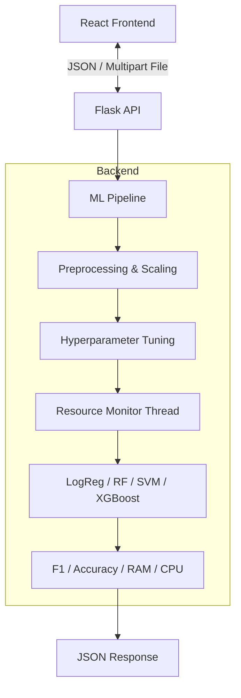

# 🤖 AutoML Model Comparator & Resource Monitor

> **A Full-Stack Application for Automated Machine Learning, Hyperparameter Tuning, and Computational Resource Profiling.**

This application allows users to upload a dataset, automatically preprocesses the data, and trains multiple state-of-the-art Machine Learning models in parallel. Uniquely, it creates a **"Resource-Aware Leaderboard"**, ranking models not just by accuracy, but by their computational cost (CPU, RAM, and Training Time), allowing engineers to find the perfect balance between performance and efficiency.

---

## 🌟 Key Features

* **⚡ Multi-Model Pipeline:** Automatically trains Logistic Regression, Random Forest, SVM, KNN, and XGBoost.
* **☑️ Custom Model Selection:** Users can toggle specific models on/off to skip computationally expensive algorithms (like SVM) on large datasets.
* **🛠 Automated Preprocessing:** Handles missing values, scales numerical features, and performs One-Hot/Label encoding for categorical data.
* **🎛 Hyperparameter Tuning:** Uses `RandomizedSearchCV` to find the best parameters for every model dynamically.
* **🖥 Hardware Profiling:** A custom-built `ResourceMonitor` tracks **Peak RAM (MB)** and **CPU Usage (%)** in real-time during training.
* **📊 Interactive Leaderboard:** A React-based UI that allows sorting by **Accuracy**, **F1-Score**, **Speed**, or **Efficiency** (low resource usage).
* **🧠 Dynamic Recommendations:** Automatically suggests the best model based on the user's priority (e.g., "I need the fastest model" vs "I need the most accurate model").

---

## 🏗 Architecture

The application follows a decoupled Client-Server architecture:



---

## 🛠 Tech Stack

### **Backend (Python)**
* **Flask:** API Server.
* **Scikit-Learn:** Model training and preprocessing pipelines.
* **XGBoost:** Gradient boosting implementation.
* **Pandas & NumPy:** Data manipulation.
* **Psutil:** System resource monitoring (RAM/CPU).
* **Joblib:** Parallel processing.

### **Frontend (React)**
* **React.js:** Component-based UI.
* **Axios:** HTTP Client.
* **Bootstrap 5:** Responsive styling and layout.

---

## 🚀 Installation & Setup

### 1. Prerequisites
* Python 3.8+
* Node.js & npm
* *(macOS Users only)*: `brew install libomp` (Required for XGBoost)

### 2. Backend Setup
Navigate to the backend folder and set up the Python environment.

```bash
cd backend

# Create Virtual Environment
python3 -m venv .venv

# Activate Environment
# On macOS/Linux:
source .venv/bin/activate
# On Windows:
# .venv\Scripts\activate

# Install Dependencies
pip install -r requirements.txt
```

### 3. Frontend Setup
Open a new terminal, navigate to the frontend folder, and install Node modules.

```bash
cd frontend

# Install dependencies
npm install
```

---

## ▶️ Usage Guide

### 1. Start the Server
In your **Backend** terminal:
```bash
python app.py
```
*Server will start on `http://127.0.0.1:5000`*

### 2. Launch the UI
In your **Frontend** terminal:
```bash
npm start
```
*App will open at `http://localhost:3000`*

### 3. Run the Pipeline
1.  **Upload Data:** Select a clean CSV file (e.g., Iris, Titanic, Breast Cancer).
2.  **Target Column:** Type the exact name of the column you want to predict (case-sensitive).
3.  **Launch:** Click "Launch Pipeline".
4.  **Analyze:** Use the dropdown menu to sort results by **F1 Score** (for quality) or **CPU/Time** (for efficiency).

---

## 📂 Project Structure

```text
automl-app/
├── backend/                 # Python Flask Server
│   ├── .venv/               # Virtual Environment
│   ├── app.py               # API Entry Point
│   ├── pipeline.py          # ML Training & Tuning Logic
│   ├── monitor.py           # Custom RAM/CPU Tracker
│   ├── requirements.txt     # Python Dependencies
│   └── uploads/             # Temporary storage for datasets
│
├── frontend/                # React Client
│   ├── src/
│   │   ├── App.js           # Main Upload Interface
│   │   ├── Leaderboard.js   # Results Table & Sorting Logic
│   │   └── index.js         # Entry point
│   ├── public/
│   └── package.json         # JS Dependencies
│
└── README.md                # Documentation
```

---

## 🧠 How It Works

### The Resource Monitor
Standard ML libraries do not report hardware usage. This project uses a custom Context Manager (`backend/monitor.py`) that spawns a background thread alongside the model training.

```python
# Example logic
with ResourceMonitor() as monitor:
    model.fit(X_train, y_train)
print(monitor.max_ram) # Reports peak memory usage
```

### The Sorting Logic (Smart Sort)
The frontend implementation (`Leaderboard.js`) uses a multi-tiered sorting algorithm:
* **Accuracy Mode:** Sorts by Accuracy (Desc) -> Tie-breaker: Time (Asc).
* **Efficiency Mode:** Sorts by CPU (Asc) -> Tie-breaker: F1 Score (Desc).

---

## 🔮 Future Roadmap

* [ ] **Regression Support:** Add support for continuous target variables (currently Classification only).
* [ ] **Model Download:** Button to download the `.pkl` file of the best model.
* [ ] **Visualizations:** Add Confusion Matrix and ROC-Curve plots.
* [ ] **Docker:** Containerize the application for easy deployment.

---
