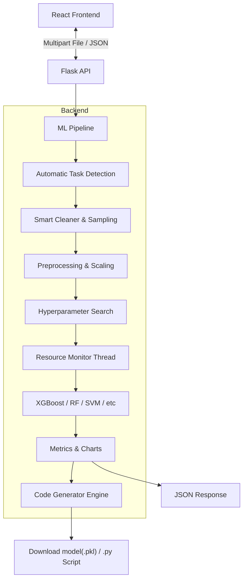

# 🤖 AutoML Model Comparator & Code Generator

> **A Modern, Full-Stack AutoML Platform for Classification & Regression**  
> *Featuring Python Code Generation, Glassmorphism UI, Resource Profiling, and Intelligent Task Detection*

[](https://github.com/bhagyeshrathi07/AutoML)

This application allows users to upload any dataset (CSV), automatically detects the task type (**Classification** or **Regression**), and trains multiple state-of-the-art machine learning models in parallel.

It goes beyond simple metrics by providing a **Resource-Aware Leaderboard** (CPU/RAM efficiency), **Interactive Visualizations** (ROC Curves/Confusion Matrices/Scatter Plots), and a unique **Code Generation Engine** that writes clean, reproducible Python scripts for your winning model.

---

## 🌟 Key Features

### 🧠 Dual-Mode Machine Learning
* **🎯 Classification:** Logistic Regression, Random Forest, SVM, KNN, XGBoost, Decision Tree
    * *Metrics:* Accuracy, F1 Score, Precision, Recall, ROC-AUC
    * *Visuals:* Interactive ROC Curves & Confusion Matrices
* **📈 Regression:** Linear Regression, Random Forest, XGBoost, Decision Tree, SVM (SVR/SGD)
    * *Metrics:* R² Score, RMSE, MAE
    * *Visuals:* Actual vs. Predicted Scatter Plots with Perfect Fit lines

### 🎯 Intelligent Task Detection
* **Automatic Classification/Regression Detection:** Analyzes your target column and automatically determines whether your problem is classification or regression
* **Smart Model Recommendations:** Automatically selects the most appropriate models for your detected task type
* **Manual Override:** Users can override automatic detection if needed

### ⚡ Performance & Optimization
* **Expanded Hyperparameter Tuning:** Uses `RandomizedSearchCV` with comprehensive search spaces (e.g., `gamma` for SVM, `subsample` for XGBoost, `min_samples_leaf` for Trees)
* **Smart Model Switching:** Automatically switches from computationally expensive models (SVM/SVR) to optimized equivalents (SGD) when dataset rows exceed 10,000
* **Hardware Profiling:** Custom context manager tracks **Peak RAM (MB)** and **CPU Usage (%)** for every model training run
* **Stratified Sampling:** Maintains class distribution when downsampling large classification datasets

### 🎨 Modern UX & "Glassmorphism" UI
* **Instant Data Stats:** Uses intelligent "Chunk Reader" to estimate row counts for large files (1GB+) in milliseconds
* **Aesthetic Design:** Features custom CSS **Glassmorphism** interface with animated gradients and polished Dark/Light mode
* **Sortable Leaderboard:** Rank models by Accuracy/R², Training Time, or RAM efficiency
* **Real-time Progress:** Live progress bar and logs during model training

### 📜 Reproducibility & Deployment
* **Download Model:** Export the serialized `.pkl` file for immediate deployment
* **Generate Script:** Click one button to generate a clean, standalone `train_model.py` script pre-filled with the **exact hyperparameters** of the winning model
* **Full Pipeline Code:** Generated scripts include complete preprocessing, training, and evaluation code

---

## 🏗 Architecture



---

## 🛠 Tech Stack

### **Backend (Python)**
* **Flask:** REST API & Background Threading
* **Scikit-Learn:** Models, Pipelines, Imputation, and Metrics
* **XGBoost:** Optimized Gradient Boosting
* **Joblib:** Model serialization
* **Psutil:** Real-time hardware resource tracking
* **Pandas & NumPy:** Data processing and vectorization

### **Frontend (React)**
* **React 18:** Hooks-based UI architecture
* **Custom CSS:** Glassmorphism, gradients, and animations
* **Recharts:** Responsive visualizations (ROC & Scatter plots)
* **PapaParse:** Worker-based CSV parsing for large files
* **Axios:** Async polling and file uploads
* **Bootstrap 5:** Base component styling

---

## 🚀 Installation & Setup

### 1. Prerequisites
* Python 3.8+
* Node.js 14+ & npm
* *(macOS Users only)*: `brew install libomp` (Required for XGBoost)

### 2. Backend Setup
Navigate to the backend folder and set up the Python environment.

```bash
cd automl-app/backend

# Create Virtual Environment
python3 -m venv .venv

# Activate Environment
# On macOS/Linux:
source .venv/bin/activate
# On Windows:
.venv\Scripts\activate

# Install Dependencies
pip install -r requirements.txt
```

### 3. Frontend Setup
Open a new terminal, navigate to the frontend folder, and install Node modules.

```bash
cd automl-app/frontend

# Install dependencies
npm install
```

---

## ▶️ Usage Guide

### 1. Start the Backend Server
In your **Backend** terminal:
```bash
python app.py
```
*Server runs on `http://127.0.0.1:5000` with threaded task execution.*

### 2. Launch the Frontend UI
In your **Frontend** terminal:
```bash
npm start
```
*App opens at `http://localhost:3000`*

### 3. Run the Pipeline
1. **Upload:** Drop your CSV file. The app instantly estimates rows/columns
2. **Select Target:** Choose your prediction target from the dropdown
3. **Auto-Detection:** Watch as the app analyzes your target column and determines Classification vs Regression
4. **Model Selection:** Review auto-selected models or manually adjust the selection
5. **Launch:** Click "🚀 Launch Experiments" and watch real-time logs as models train in parallel

### 4. Analyze, Export, Reproduce
1. **Sort Leaderboard:** Click column headers to sort by Accuracy/R², RAM usage, Training Time, or CPU efficiency
2. **Visualize Results:** 
   - **Classification:** View Confusion Matrix and ROC Curves
   - **Regression:** Examine Actual vs. Predicted scatter plots
3. **Download Model:** Export the winning model as a `.pkl` file
4. **Generate Code:** Click **"📜 Generate Python Script"** to download a complete `.py` file that reproduces the exact model

---

## 📂 Project Structure

```text
AutoML/
├── README.md                # This file
├── automl-app/
│   ├── backend/
│   │   ├── app.py           # Flask API Routes (Upload, Status, Download)
│   │   ├── pipeline.py      # ML Logic, Sampling, Model Training
│   │   ├── codegen.py       # Python Script Generator
│   │   ├── monitor.py       # Resource (CPU/RAM) Tracker
│   │   ├── requirements.txt # Python Dependencies
│   │   ├── models/          # Temp storage for .pkl files
│   │   └── uploads/         # Temp storage for CSVs
│   │
│   └── frontend/
│       ├── src/
│       │   ├── App.js           # Main Logic, Polling, Task Detection
│       │   ├── App.css          # Glassmorphism & Animation Styles
│       │   ├── Leaderboard.js   # Sorting Logic & Results Table
│       │   ├── RegressionChart.js # Scatter Plot Component
│       │   ├── ROCChart.js      # ROC Curve Visualization
│       │   └── ConfusionMatrix.js # Confusion Matrix Display
│       ├── public/              # Static Assets
│       └── package.json         # Node Dependencies
```

---

## 🧠 Advanced Logic Explained

### 🎯 Automatic Task Detection
The system analyzes the target column to determine the appropriate task type:
- **Numeric Check:** Determines if all values are numeric
- **Cardinality Analysis:** Counts unique values
- **Heuristic:** If numeric with >10 unique values → Regression; otherwise → Classification
- **User Override:** Manual selection available if automatic detection needs adjustment

### ⚡ Smart Downsampling & Stratification
* **Classification:** For datasets >100,000 rows, performs **Stratified Sampling** to maintain class ratios (e.g., preserving minority class representation)
* **Regression:** Uses Random Sampling (stratification not applicable for continuous targets)
* **Large Data Optimization:** For datasets >10,000 rows, automatically swaps `SVC/SVR` with `SGDClassifier/SGDRegressor` to prevent timeouts while maintaining accuracy

### 📊 Imbalance Handling
* **Class Weights:** Automatically calculates `class_weight='balanced'` for all classification models
* **XGBoost Optimization:** Dynamically calculates `scale_pos_weight` (negative/positive ratio) to boost minority class detection

### 🖥️ Real-Time Resource Monitoring
The `ResourceMonitor` runs in a separate thread context, sampling memory and CPU usage every 0.2 seconds. This provides accurate metrics showing exactly how much RAM and CPU each model architecture consumed during training, helping users choose production-friendly models.

### 🔧 Hyperparameter Optimization
* **RandomizedSearchCV:** Explores hyperparameter space efficiently
* **Expanded Search Spaces:** 
  - SVM: C, kernel, gamma parameters
  - Trees: max_depth, min_samples_split, min_samples_leaf
  - XGBoost: learning_rate, n_estimators, subsample, colsample_bytree
* **Adaptive Tuning:** Adjusts n_iter based on search space size

---

## 📊 Supported Models

### Classification Models
1. **Logistic Regression** - Fast linear baseline with L1/L2 regularization
2. **Random Forest** - Ensemble learning with class balancing
3. **Support Vector Machine (SVM)** - Kernel-based classification (auto-switches to SGD for large datasets)
4. **K-Nearest Neighbors (KNN)** - Instance-based learning
5. **XGBoost** - Gradient boosting with scale_pos_weight optimization
6. **Decision Tree** - Interpretable tree-based classifier

### Regression Models
1. **Linear Regression** - Simple linear baseline
2. **Random Forest** - Ensemble regression with variance reduction
3. **Support Vector Regression (SVR)** - Kernel-based regression (auto-switches to SGD for large datasets)
4. **XGBoost** - Gradient boosting for regression
5. **Decision Tree** - Interpretable tree-based regressor

---

## 🎨 UI Features

### Dark/Light Mode
Toggle between themes with persistent localStorage saving

### Glassmorphism Design
* Frosted glass effect cards
* Gradient backgrounds
* Smooth animations and transitions
* Responsive design for all screen sizes

### Real-Time Feedback
* Progress bar with percentage
* Live training logs with monospace font
* Emoji-enhanced status messages
* Animated loading states

---

## 📈 Metrics & Visualizations

### Classification Metrics
* **Accuracy:** Overall correctness
* **F1 Score:** Harmonic mean of precision and recall
* **Precision:** True positive rate
* **Recall:** Sensitivity measure
* **ROC-AUC:** Area under receiver operating characteristic curve
* **Confusion Matrix:** Visual breakdown of predictions

### Regression Metrics
* **R² Score:** Coefficient of determination
* **RMSE:** Root mean squared error
* **MAE:** Mean absolute error
* **Scatter Plot:** Actual vs. predicted with perfect fit line

---

## 🔮 Future Roadmap

* [ ] **Feature Engineering:** Automated interaction terms and polynomial features
* [ ] **Ensemble Builder:** One-click stacking of top 3 models into voting classifier/regressor
* [ ] **Neural Networks:** Add TensorFlow/PyTorch models for deep learning
* [ ] **Time Series Support:** Add ARIMA, Prophet, and LSTM models
* [ ] **Deployment API:** One-click generation of production-ready Flask/FastAPI wrapper
* [ ] **Cloud Integration:** Direct deployment to AWS/GCP/Azure
* [ ] **Explainability:** SHAP values and feature importance visualization
* [ ] **Automated Feature Selection:** Remove redundant/irrelevant features
* [ ] **Multi-target Support:** Handle multiple target columns simultaneously

---

## 🤝 Contributing

Contributions are welcome! Please feel free to submit a Pull Request to the [GitHub repository](https://github.com/bhagyeshrathi07/AutoML).


## 📄 License

This project is open source and available under the MIT License.

## 🔗 Links

* **GitHub Repository:** [https://github.com/bhagyeshrathi07/AutoML](https://github.com/bhagyeshrathi07/AutoML)
* **Issues & Feature Requests:** [GitHub Issues](https://github.com/bhagyeshrathi07/AutoML/issues)

---

## 👥 Authors

Built by the AutoML Team:
 - Bhagyesh Rathi
 - Hriday Ampavatina
 - Akshay Kumar
 - Ronak Patel
